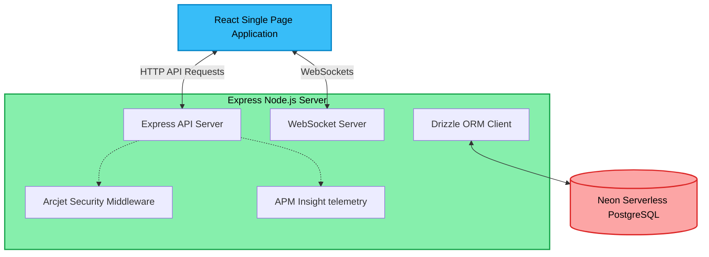

# Sportz — Real-Time Match & Commentary Platform

Sportz is a modern, high-performance, full-stack application designed to stream real-time sports match scores, statuses, and live text commentary. It integrates real-time updates via WebSockets with a fluid, responsive React client.

---

## 🏛️ System Architecture

The application is structured as a decoupled monorepo containing a frontend client and a backend API server.



### Architectural Components

1.  **Frontend SPA (React & Vite):**
    *   Initiates an HTTP fetch connection to load historical match data and commentary.
    *   Establishes a persistent **WebSocket connection** to listen for live score updates, match creation, and commentary logs.
    *   Uses **Framer Motion** to animate lists and update UI elements dynamically as new data arrives.
2.  **Backend Server (Express & WS):**
    *   **Express API Router:** Handles traditional REST routes for match queries, match creation, and score updating.
    *   **WebSocket Server:** Attaches to the HTTP server, managing connection subscriptions and broadcasting live updates to active clients.
3.  **Database & Schema Layer (Drizzle ORM & Postgres):**
    *   Maintains the structure of matches and commentaries.
    *   Automates schema migrations using `drizzle-kit migrate` directly at startup.
4.  **Security & Audits (Arcjet):**
    *   Protects backend API endpoints against excessive requests, SQL injections, and bot traffic.
5.  **Telemetry & Analytics (APM Insight):**
    *   Tracks Express server performance, database latencies, and transactions.

---

## 📂 Codebase Directory Layout

```
Sportz/
├── README.md                     # Project documentation and architecture
├── render.yaml                   # Infrastructure-as-code configuration for Render
├── backend/                      # Node.js Express server
│   ├── src/
│   │   ├── db/                   # Database client & schema definitions
│   │   ├── routes/               # Express API endpoints (matches, commentary)
│   │   ├── validation/           # Zod schema validations
│   │   ├── ws/                   # WebSocket connection & broadcast handlers
│   │   ├── arcjet.js             # Security middleware configuration
│   │   └── index.js              # Server entry point
│   ├── drizzle/                  # Auto-generated SQL migration files
│   └── package.json              # Backend dependencies & start scripts
│
└── frontend/                     # React Vite client
    ├── src/
    │   ├── App.jsx               # React core layout & WebSocket event listener
    │   ├── index.css             # Tailwind setup and custom styles
    │   └── main.jsx              # Application mount point
    └── package.json              # Frontend client dependencies & scripts
```

---

## 💻 Local Development Setup

To run both services locally, follow these instructions:

### Prerequisites
*   Node.js (v18 or higher)
*   A running PostgreSQL instance (or Neon project URL)

### 1. Backend Setup
1.  Navigate to the `backend` directory:
    ```bash
    cd backend
    ```
2.  Install dependencies:
    ```bash
    npm install
    ```
3.  Create a `.env` file in the `backend` directory and add your connection variables:
    ```env
    DATABASE_URL="postgresql://<user>:<password>@<host>/<database>?sslmode=require"
    PORT=8000
    HOST=0.0.0.0
    ARCJET_KEY="your-arcjet-key"
    ARCJET_ENV="development"
    ARCJET_MODE="DRY_RUN"
    ```
4.  Generate and apply the database migrations:
    ```bash
    npm run db:generate
    npm run db:migrate
    ```
5.  Start the development server:
    ```bash
    npm run dev
    ```

### 2. Frontend Setup
1.  Navigate to the `frontend` directory:
    ```bash
    cd frontend
    ```
2.  Install dependencies:
    ```bash
    npm install
    ```
3.  Start the Vite local development server:
    ```bash
    npm run dev
    ```
4.  Open [http://localhost:5173](http://localhost:5173) in your browser.

---

## 🚀 Deployed Environments (Render)

This project is configured to run on **Render** (Free plan). The configurations are defined inside the [render.yaml](file:///Users/amitgupta/Desktop/Projects/Sportz/render.yaml) blueprint file at the root directory:

*   **Backend (Web Service):** Runs database migrations dynamically upon startup and deploys the Express Node API.
*   **Frontend (Static Site):** Automatically compiles Vite assets and serves them globally via Render's CDN, resolving the backend API dynamically.
